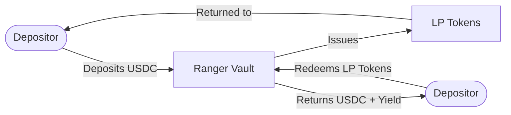
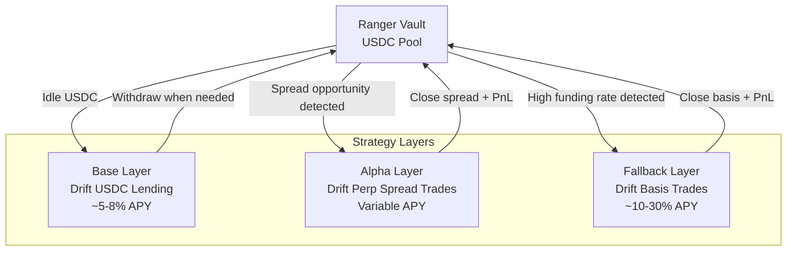
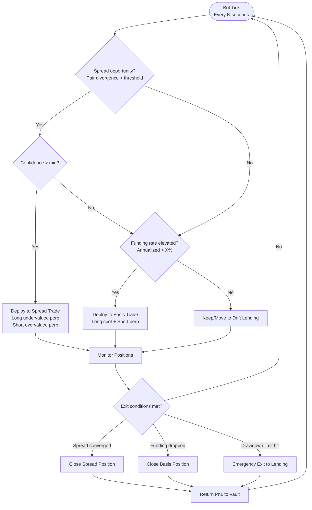
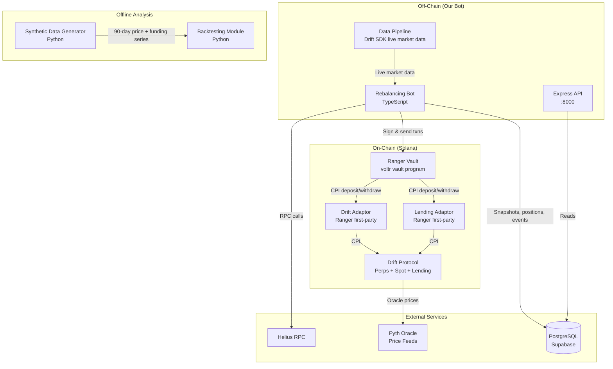
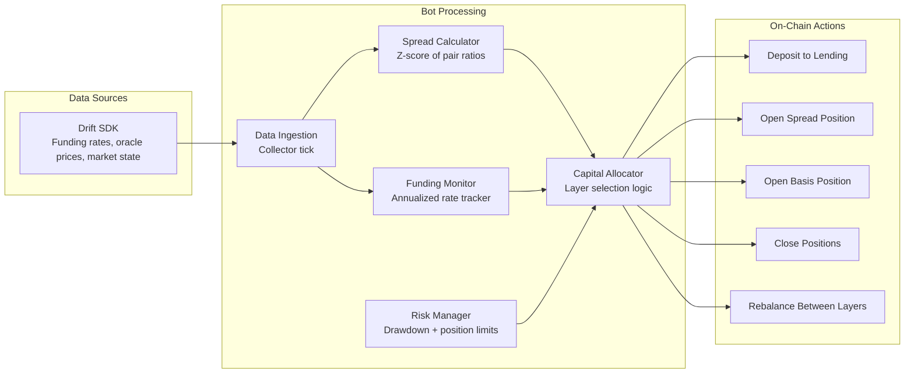

# Architecture

Trident is a multi-layer USDC vault on Solana. Depositors hold LP tokens against a Ranger vault; an off-chain bot routes the vault's capital between three Drift Protocol strategies and pulls it back to lending when risk limits bind.

This document covers system topology and control flow. For the process-level view of the backend (startup order, tick loop, DB writes) see [`README.md`](../README.md#architecture); for why these three strategies are combined see [`docs/strategy.md`](strategy.md).

---

## Strategy Overview

Most vault strategies do one thing. Trident does three, adaptively:

1. **Base Layer (Lending)** — USDC lent on Drift for a steady ~5-8% APY floor. Capital is always earning.
2. **Alpha Layer (Spread Trading)** — When correlated Drift perp pairs (SOL/ETH, BTC/ETH) diverge beyond statistical thresholds, capital is deployed into mean-reversion spread trades.
3. **Fallback Layer (Basis Trading)** — When no spread setups exist but funding rates are elevated, capital is deployed into delta-neutral basis trades (long spot + short perp) for funding rate capture.

An off-chain bot continuously monitors conditions and rebalances across layers.

---

## User Flow

## Vault Capital Flow

## Bot Decision Flow

## System Architecture

> The backtester runs offline against generated data. It does not read from Drift and does not feed parameters back into the bot — `BOT_CONFIG` is maintained by hand and mirrored in `packages/backtester/src/config.py`.

## Data Flow

