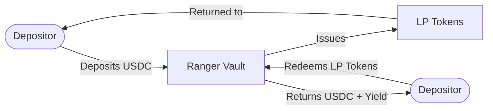
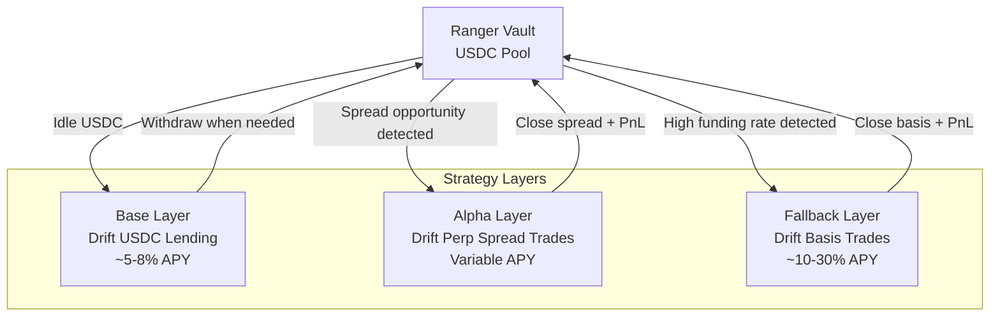
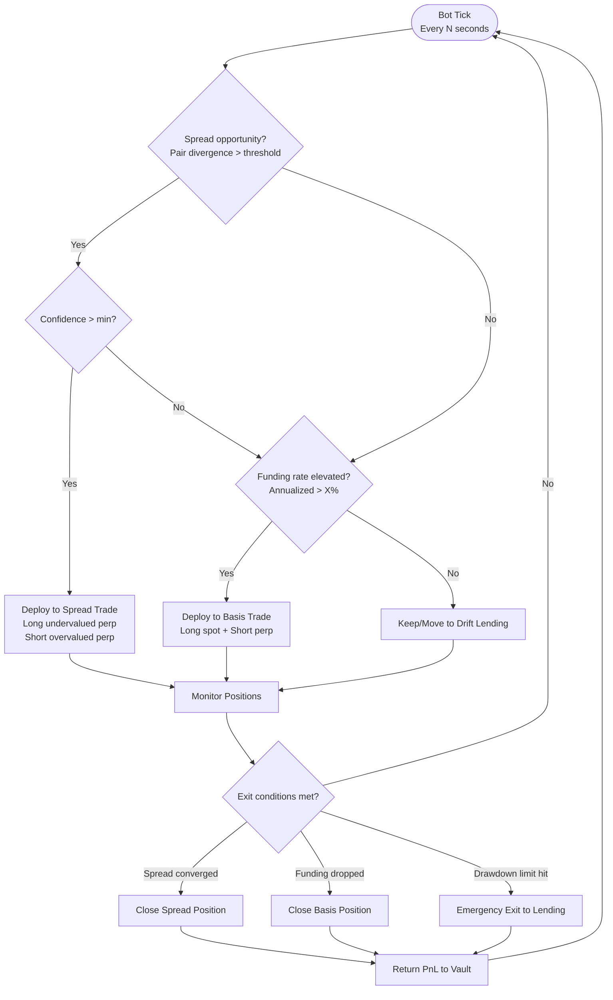
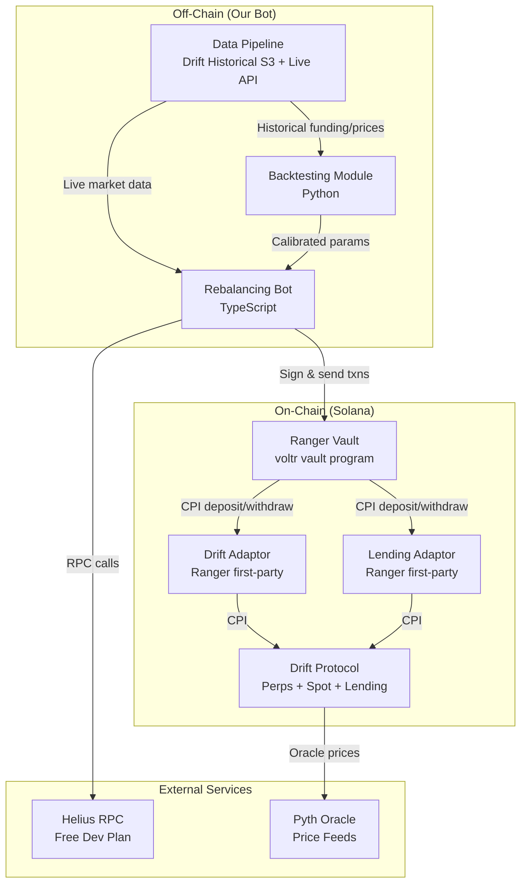
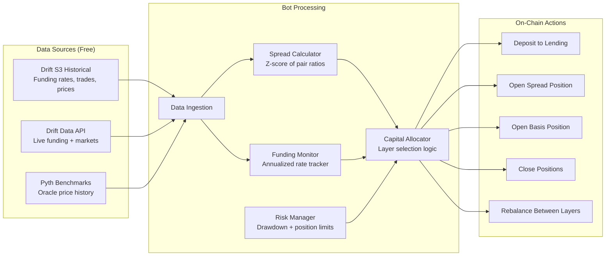

# Ranger Build-A-Bear Hackathon - Objective

## Hackathon Links

- **Main Track:** https://superteam.fun/earn/listing/ranger-build-a-bear-hackathon-main-track
- **Drift Side Track:** https://superteam.fun/earn/listing/ranger-build-a-bear-hackathon-drift-side-track
- **Hackathon Landing Page:** https://ranger.finance/build-a-bear-hackathon
- **Ranger Earn Docs:** https://docs.ranger.finance/
- **Drift Docs:** https://docs.drift.trade/protocol
- **Telegram:** https://t.co/OnDFZVjH3N

---

## Key Details

| Detail                  | Value                                             |
| ----------------------- | ------------------------------------------------- |
| **Organizer**           | Ranger Finance (backed by Presto Labs)            |
| **What**                | Build production-ready vault strategies on Solana |
| **Build Window**        | Mar 9 - Apr 6, 2026                               |
| **Submission Deadline** | Apr 6, 23:59 UTC                                  |
| **Judging**             | Apr 7 - 11                                        |
| **Results**             | Apr 14                                            |

### Tracks & Prizes

| Track                | 1st                 | 2nd                 | 3rd                 |
| -------------------- | ------------------- | ------------------- | ------------------- |
| **Main Track**       | $500K vault seeding | $300K vault seeding | $200K vault seeding |
| **Drift Side Track** | $100K vault seeding | $60K vault seeding  | $40K vault seeding  |

> Using Drift qualifies for **both tracks simultaneously** with separate submissions.

### Additional Prizes (Main Track Top 3)

- $15,000 audit credits (Adevar Labs)
- 3 months free MPC wallet infra (Cobo)
- $10,000 AWS credits each (9 total across tracks)

### Eligibility Constraints

- **Base Asset:** USDC
- **Minimum APY:** 10%
- **Tenor:** 3-month rolling lock
- **Disqualified sources:** DEX LP vaults (JLP, HLP, LLP), junior tranches (RLP, jrUSDe), ponzi yield-bearing stables, high-leverage looping (health < 1.05)

### Judging Criteria

1. **Strategy Quality & Edge** - genuine alpha, defensible thesis
2. **Risk Management** - drawdown limits, liquidation protection, position sizing
3. **Technical Implementation** - code quality, adaptor integration, vault architecture
4. **Production Viability** - realistic deployment, scalability
5. **Novelty & Innovation** - new primitives, creative protocol combinations

### Submission Requirements

1. Demo/pitch video (max 3 min)
2. Strategy documentation (thesis, mechanics, risk management)
3. Code repository (public or private with @jakeyvee access)
4. On-chain verification (wallet/vault address with trade activity)
5. CEX trade history CSV + read-only API key (if applicable)

---

## Our Strategy: Hybrid Yield Vault (Lending + Spread Trading + Basis)

A multi-layer USDC vault on Ranger that combines safe base yield with opportunistic alpha from Drift perp spread trading and basis trades.

### Strategy Thesis

Most vault strategies do one thing - we do three, adaptively:

1. **Base Layer (Lending):** USDC lent on Drift for steady ~5-8% APY floor. Capital is always earning.
2. **Alpha Layer (Spread Trading):** When correlated Drift perp pairs (SOL/ETH, BTC/ETH) diverge beyond statistical thresholds, deploy capital into mean-reversion spread trades. This is the novel/differentiated edge.
3. **Fallback Layer (Basis Trading):** When no spread setups exist but funding rates are elevated, deploy into delta-neutral basis trades (long spot + short perp) for funding rate capture.

An off-chain bot continuously monitors conditions and rebalances across layers.

### Why This Wins

- **Strategy Edge:** Spread trading on Drift perps is genuinely novel on-chain
- **Risk Management:** Lending floor ensures capital is never idle; spread/basis positions are delta-neutral
- **Technical Quality:** Multi-adaptor composition via Ranger SDK, clean bot architecture
- **Production Viability:** Each layer uses battle-tested protocols (Drift lending, Drift perps)
- **Novelty:** On-chain perp spread trading + adaptive multi-layer allocation

---

## User Flow

## Vault Capital Flow

## Bot Decision Flow

## System Architecture

## Data Flow

