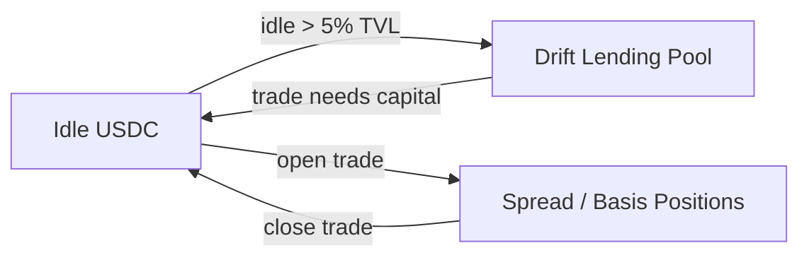
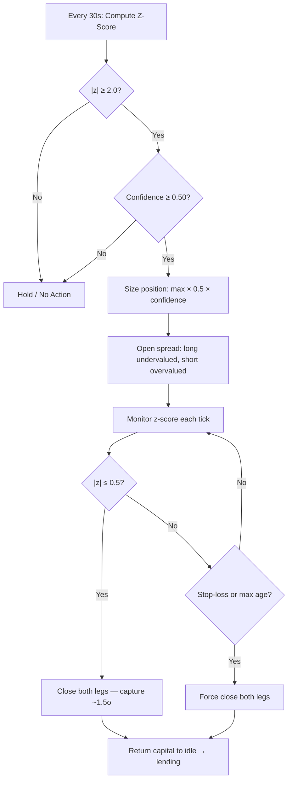
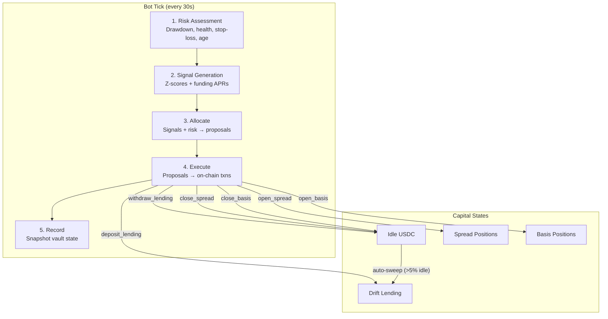
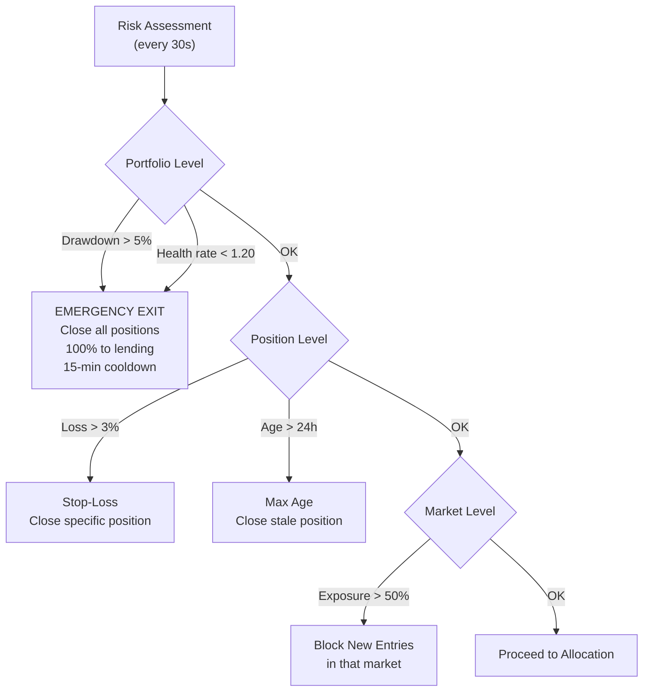

# Trident: A Multi-Layer Adaptive Yield Strategy on Drift Protocol

## Abstract

Single-strategy vaults are fragile. Lending-only vaults cap returns at 6-8% APY. Basis-only vaults bleed when funding regimes shift. Pure spread trading is too volatile for passive depositors. Trident solves this by composing three complementary yield layers — USDC lending, perpetual spread trading, and delta-neutral basis capture — into a single adaptive vault on Drift Protocol via Ranger Finance. An off-chain bot evaluates statistical signals every 30 seconds and dynamically allocates capital to the highest risk-adjusted opportunity, maintaining a lending floor that ensures capital is never idle. The result: a target of 10%+ blended APY with a hard 5% maximum drawdown, achieved through strategies with near-zero net directional market exposure.

---

## Table of Contents

1. [Investment Thesis](#1-investment-thesis)
2. [Strategy Layer 1: USDC Lending](#2-strategy-layer-1-usdc-lending)
3. [Strategy Layer 2: Perpetual Spread Trading](#3-strategy-layer-2-perpetual-spread-trading)
4. [Strategy Layer 3: Basis Trading](#4-strategy-layer-3-basis-trading)
5. [Capital Allocation Engine](#5-capital-allocation-engine)
6. [Risk Management Framework](#6-risk-management-framework)
7. [Scenario Analysis & Expected Returns](#7-scenario-analysis--expected-returns)
8. [Innovation & Novelty](#8-innovation--novelty)
9. [Production Considerations](#9-production-considerations)
10. [Appendix: Parameter Reference](#10-appendix-parameter-reference)

---

## 1. Investment Thesis

### The Problem with Single-Strategy Vaults

Most DeFi yield vaults commit to one source of return and live or die by it:

- **Lending vaults** earn stable but capped yields (Drift USDC lending: ~6-8% APY). They meet the hackathon's 10% APY minimum only during peak borrow demand.
- **Basis vaults** capture funding rate carry but suffer when funding regimes flip. A vault that entered a basis trade at +20% APR can find itself paying funding at -10% APR within hours.
- **Directional vaults** (leveraged long/short) expose depositors to catastrophic drawdowns during volatility spikes.

The fundamental issue: a single strategy's return profile is tightly coupled to one market condition. When that condition disappears, the vault underperforms or loses capital.

### The Trident Approach

Trident layers three strategies with distinct return drivers and low cross-correlation:

| Layer | Return Driver | When It Activates | Market Regime |
|---|---|---|---|
| **Lending** (base) | Borrow demand for USDC | Always on | All regimes |
| **Spread Trading** (alpha) | Mean reversion of correlated perp ratios | Pair divergence exceeds 2σ | Volatile / rotational |
| **Basis Trading** (fallback) | Perpetual funding rate carry | Funding APR > 15% and stable | Trending / crowded |

Capital flows between layers based on real-time signals. In quiet markets, 100% sits in lending earning the base rate. When spread or basis opportunities appear, capital is withdrawn from lending to capture higher-yielding trades. When those trades close, capital returns to lending. The vault self-optimizes to the current market regime without manual intervention.

### Why These Strategies Are Complementary

The three return drivers are weakly correlated:

|  | Lending | Spread | Basis |
|---|---|---|---|
| **Lending** | — | Low | Low |
| **Spread** | Low | — | Weak |
| **Basis** | Low | Weak | — |

- **Lending** depends on USDC borrow demand on Drift — driven by leveraged trading activity, largely independent of specific asset price moves.
- **Spread trading** profits when correlated assets temporarily diverge and then reconverge. It needs volatility and rotation, not a directional trend.
- **Basis trading** profits when one side of the market is crowded (high funding). It thrives in trending markets where leveraged longs or shorts pile up.

Crucially, spread and basis tend to activate in different regimes. High funding rates (basis opportunity) typically occur during strong directional trends, while spread divergence occurs during choppy rotation. When neither is present, all capital earns lending yield. The result is a portfolio with multiple uncorrelated return streams and a guaranteed yield floor.

---

## 2. Strategy Layer 1: USDC Lending

### Mechanism

USDC deposited into the vault is lent on Drift Protocol's lending pool. Borrowers (leveraged traders, cross-margined positions) pay variable interest that accrues to lenders. This is the lowest-risk, lowest-return layer — and it serves as the capital parking layer for the entire vault.

### Allocation Rules

- **Minimum allocation:** 30% of total vault value (TVL) is always in lending
- **Maximum allocation:** 100% of TVL (when no spread or basis opportunities exist)
- **Idle capital:** any USDC not currently deployed to spread/basis trades or committed to lending is considered "idle"

The lending layer acts as a reserve from which the other two layers draw capital and to which they return it.

### Rebalance Mechanics

To avoid unnecessary on-chain transactions (each costing compute and creating audit noise), lending rebalance is threshold-based:

**Deposit to lending** (idle → lending):
- Trigger: idle capital exceeds 5% of TVL
- Action: sweep idle into lending, retaining a 1% buffer
- Minimum transaction: $10 USDC

**Withdraw from lending** (lending → idle):
- Trigger: an upcoming spread or basis trade needs more capital than is currently idle
- Guard: only withdraw if lending allocation would remain above 30% + 5% (the minimum allocation plus the rebalance threshold)
- Amount: min(capital deficit, excess lending above minimum)
- Minimum transaction: $10 USDC

This threshold approach means the vault does not rebalance on every tick — only when the allocation has drifted meaningfully. At a 30-second tick interval, this prevents up to 2,880 unnecessary transactions per day.

### Expected Return

Drift USDC lending rates fluctuate with market activity. Historical ranges:

| Market Condition | Lending APY |
|---|---|
| Quiet (low leverage demand) | 4-6% |
| Normal | 6-8% |
| High activity (volatile markets) | 8-15% |

The lending layer alone does not meet the hackathon's 10% APY target in most conditions — which is precisely why the other two layers exist.

---

## 3. Strategy Layer 2: Perpetual Spread Trading

This is the core differentiating strategy — on-chain perpetual spread trading is genuinely novel in DeFi.

### Thesis

Correlated perpetual futures pairs (SOL/ETH, BTC/ETH) on Drift maintain a ratio that mean-reverts over time. When this ratio deviates beyond a statistically significant threshold, we deploy a delta-neutral spread trade that profits from the convergence back to the mean.

The intuition: SOL and ETH are both Layer-1 smart contract platforms with high fundamental correlation. Their perp prices move together in response to macro crypto sentiment. But idiosyncratic events (ecosystem-specific news, liquidation cascades in one market, temporary liquidity imbalances) cause the ratio to deviate. These deviations are temporary — the ratio reverts because the underlying correlation reasserts itself.

### Mathematical Framework

#### Price Ratio

For a pair (A, B), we compute the price ratio at each tick:

$$R_t = \frac{P_A(t)}{P_B(t)}$$

where $P_A(t)$ and $P_B(t)$ are oracle prices from Drift's Pyth integration.

#### Rolling Statistics

Over a lookback window of N = 2,880 samples (24 hours at 30-second intervals), we compute:

**Rolling mean:**

$$\mu = \frac{1}{N} \sum_{i=1}^{N} R_i$$

**Population standard deviation:**

$$\sigma = \sqrt{\frac{1}{N} \sum_{i=1}^{N} (R_i - \mu)^2}$$

We use population standard deviation (not sample) because we are characterizing the observed distribution, not estimating a population parameter from a sample.

#### Z-Score

The z-score measures how many standard deviations the current ratio is from the rolling mean:

$$z_t = \frac{R_t - \mu}{\sigma}$$

A z-score of 0 means the ratio is at its 24-hour mean. A z-score of +2.0 means the ratio is 2 standard deviations above the mean — pair A is relatively overvalued compared to pair B.

#### Entry and Exit Conditions

| Condition | Z-Score Threshold | Action |
|---|---|---|
| **Enter long** | z ≤ -2.0 | A is undervalued vs B: long A, short B |
| **Enter short** | z ≥ +2.0 | A is overvalued vs B: short A, long B |
| **Exit** | \|z\| ≤ 0.5 | Ratio has reverted near the mean: close both legs |
| **Hold** | -2.0 < z < -0.5 or 0.5 < z < 2.0 | No action |

The 2.0σ entry threshold is conservative by design. Under a normal distribution, values beyond 2σ occur only ~4.6% of the time (2.3% per tail). This means we only enter trades when the divergence is statistically extreme, giving a high probability of reversion.

The 0.5σ exit threshold closes the position well before the ratio overshoots to the opposite side, capturing the bulk of the reversion move without waiting for a perfect mean touch.

#### Expected Per-Trade Capture

Each successful trade captures approximately 1.5σ of the ratio move (from the 2.0σ entry to the 0.5σ exit). The dollar PnL depends on position size and the ratio's volatility:

$$\text{PnL}_{\text{trade}} \approx \text{size}_{\text{USDC}} \times \frac{1.5\sigma}{\mu}$$

The term $\frac{1.5\sigma}{\mu}$ represents the percentage move in the ratio from entry to exit. For typical SOL/ETH ratios with ~1-3% daily volatility in the ratio, this corresponds to a ~1.5-4.5% move captured per trade.

### Confidence Scoring

Not all signals are created equal. A z-score computed from 100 data points carries less statistical weight than one computed from 2,880 data points (a full 24-hour window). We model this with a confidence score:

$$\text{confidence} = \min\left(1.0, \frac{n}{2880}\right)$$

where n is the number of available data points. The system enforces:

- **Minimum data points:** 30 samples (~15 minutes) before any z-score is computed
- **Minimum confidence to trade:** 0.50 (at least 1,440 samples = 12 hours of data)
- **Position sizing scales with confidence** (see below)

This prevents the bot from trading on insufficient statistical evidence — particularly important after restarts or data gaps.

### Position Sizing

Position size is a function of available capital and signal confidence:

$$\text{size} = \min\left(\text{max\_spread\_usdc} \times 0.5 \times \text{confidence},\ \text{max\_spread\_usdc}\right)$$

where `max_spread_usdc` is the remaining allocation capacity for spread trades (total TVL × 40% minus existing spread positions). The 0.5 base factor means we deploy half the available allocation per trade, reserving capacity for the second pair. At full confidence, a single trade takes up to 50% of the spread allocation (20% of TVL). At minimum confidence (0.5), it takes 25% of the spread allocation (10% of TVL).

The minimum position size is $10 USDC to avoid dust transactions.

### Pair Selection

| Pair | Correlation Basis | Spread Opportunity Source |
|---|---|---|
| **SOL/ETH** | Both L1 smart contract platforms; high beta correlation | SOL has higher idiosyncratic volatility (ecosystem events, meme coin activity, validator economics) creating frequent divergences |
| **BTC/ETH** | The two dominant crypto assets; highly correlated in macro moves | Diverge during risk-on/risk-off rotations (BTC as "digital gold" vs ETH as "tech bet") |

Both pairs share a key property: high baseline correlation with episodic divergence — the ideal setup for mean-reversion spread trading.

### Trade Mechanics

When `z ≥ 2.0` for SOL/ETH (SOL is relatively overvalued):

1. **Short SOL perp** — profit if SOL underperforms
2. **Long ETH perp** — profit if ETH outperforms
3. Capital split: 50% of position USDC into each leg (adjusted by oracle price for contract sizing)

The combined position is **market-neutral** to overall crypto direction. If both SOL and ETH drop 10%, the short SOL profits and the long ETH loses — roughly offsetting. The trade profits only from the *convergence of the ratio*, not from the direction of the market.

When `|z| ≤ 0.5` (ratio reverted):

4. **Close both legs** simultaneously
5. Net PnL = (SOL short PnL) + (ETH long PnL)
6. Return capital to idle → swept to lending on next tick

### Why Spread Trading Works On-Chain

Perpetual spread trading is a well-established strategy in traditional finance (pairs trading, statistical arbitrage). On Solana + Drift, it becomes viable on-chain for the first time because:

1. **Sub-second finality** — trades execute in ~400ms, fast enough for 30-second signal cycles
2. **Low transaction costs** — ~$0.001 per transaction on Solana vs $5-50 on Ethereum
3. **Deep perp liquidity** — Drift's SOL, BTC, and ETH perpetuals have sufficient depth for the position sizes this vault targets
4. **Oracle price feeds** — Pyth oracles provide high-frequency, low-latency price data directly on-chain
5. **Cross-margined collateral** — both legs of a spread trade share the same USDC collateral pool on Drift, capital-efficient

---

## 4. Strategy Layer 3: Basis Trading

### Thesis

Perpetual futures pay or receive a funding rate that keeps their price anchored to the spot price. When the funding rate is elevated (typically during strong directional trends when leveraged traders crowd one side), we can capture this carry by holding an offsetting position that neutralizes directional risk.

### Mathematical Framework

#### Funding APR

Drift's funding rate is a periodic payment between longs and shorts. We annualize it for comparison across strategies:

$$\text{APR} = \frac{\text{funding\_rate}}{\text{oracle\_price}} \times 24 \times 365 \times 100$$

This converts the raw funding rate (paid per funding period) into an annualized percentage. A funding rate of 0.001% per hour on a $150 SOL translates to:

$$\text{APR} = \frac{0.001\% \times P}{P} \times 24 \times 365 \times 100 = 8.76\%$$

#### Entry and Exit Conditions

| Condition | Rule | Action |
|---|---|---|
| **Enter basis** | \|APR\| ≥ 15% AND no sign flip from previous tick | Open delta-neutral position |
| **Exit basis** | Funding sign flipped AND \|APR\| < 15% | Close position |
| **Hold** | All other cases | No action |

The entry requires two conditions:
1. **Magnitude:** the annualized rate must be attractive (≥ 15%)
2. **Stability:** the rate must not have just flipped sign (indicating regime change)

The exit also requires two conditions, preventing premature closure during temporary dips:
1. **Direction change:** funding flipped (positive → negative or vice versa)
2. **Below threshold:** the new rate is not worth capturing in the opposite direction

### Delta-Neutral Construction

**When funding is positive** (longs pay shorts, typical in bull markets):
- **Short perp** — receive funding payments
- **Long spot** — hedge directional exposure
- Net market exposure: approximately zero
- Profit source: funding payments received minus spot borrowing cost (if any)

**When funding is negative** (shorts pay longs, typical in bear markets):
- **Long perp** — receive funding payments
- **Short spot** — hedge directional exposure
- Net market exposure: approximately zero
- Profit source: funding payments received

### Why 15% APR Threshold

The 15% entry threshold is derived from opportunity cost analysis:

1. **Lending opportunity cost:** capital in a basis trade is not earning lending yield (~6-8% APY). The net benefit must exceed this delta.
2. **Transaction costs:** opening and closing both legs incurs ~4 transactions × $0.001 = $0.004. Negligible in dollar terms, but the round-trip slippage on entry/exit is the real cost (~0.05-0.10% per leg, ~0.2% round-trip for both legs).
3. **Minimum hold period:** at 15% APR, a position held for 1 day earns ~0.041% in funding. After a ~0.2% round-trip cost, break-even is approximately 5 days. Below 15% APR, the breakeven extends uncomfortably.

| Entry APR | Daily Funding Earned | Round-Trip Cost | Break-Even Days | Net APY (if held 7 days) |
|---|---|---|---|---|
| 10% | 0.027% | ~0.20% | ~7.4 | ~0.8% (annualized ~4%) |
| 15% | 0.041% | ~0.20% | ~4.9 | ~2.7% (annualized ~14%) |
| 20% | 0.055% | ~0.20% | ~3.6 | ~4.8% (annualized ~25%) |
| 30% | 0.082% | ~0.20% | ~2.4 | ~8.5% (annualized ~44%) |

At 15% APR, even short-duration trades (1 week) produce meaningful carry after costs. Below 15%, the risk-reward is insufficient relative to the guaranteed lending yield.

### Position Sizing

Basis trades use the same sizing function as spread trades but without confidence scaling:

$$\text{size} = \text{max\_basis\_usdc} \times 0.5$$

where `max_basis_usdc` is the remaining capacity (TVL × 30% minus existing basis positions). The 0.5 factor reserves capacity for additional basis positions across different markets. Minimum position: $10 USDC.

One basis position per market (SOL, BTC, ETH) is allowed at a time, preventing overlapping exposure.

---

## 5. Capital Allocation Engine

### Dynamic Allocation Model

The capital allocator converts raw signals into executable proposals. It runs once per bot tick (every 30 seconds) and produces an ordered list of actions.

#### Allocation Bounds

| Layer | Minimum | Maximum | Trigger |
|---|---|---|---|
| Lending | 30% of TVL | 100% of TVL | Default (always active) |
| Spread | 0% of TVL | 40% of TVL | z-score signal + confidence gate |
| Basis | 0% of TVL | 30% of TVL | Funding APR ≥ 15% + stability gate |

The sum constraint is implicit: lending absorbs whatever is not allocated to active trades. At maximum utilization (40% spread + 30% basis), lending holds its minimum 30%.

#### Priority Order

Proposals are generated in strict priority order:

1. **Emergency exit** — if drawdown > 5% or health rate < 1.20, close ALL positions immediately
2. **Risk-mandated closures** — stop-loss (3% per position) and max-age (24h) force-closes
3. **Spread signal evaluation** — open/close spread positions based on z-scores
4. **Funding signal evaluation** — open/close basis positions based on funding rates
5. **Lending rebalance** — sweep idle to lending or withdraw for upcoming trades
6. **No-op** — if no action is needed, log it for the audit trail

This priority ensures that risk management always takes precedence over new trades, and new trades take precedence over capital optimization.

### Capital Flow

### Blended APY Formula

The vault's aggregate yield is the allocation-weighted sum of each layer's return:

$$\text{APY}_{\text{vault}} = w_L \cdot \text{APY}_L + w_S \cdot \text{APY}_S + w_B \cdot \text{APY}_B$$

where:
- $w_L$ = lending allocation weight (0.30 to 1.00)
- $w_S$ = spread allocation weight (0.00 to 0.40)
- $w_B$ = basis allocation weight (0.00 to 0.30)
- $w_L + w_S + w_B = 1.00$

The key insight: $\text{APY}_L$ is always positive (lending never loses money in normal conditions). The spread and basis layers contribute alpha on top of this floor. Even if spread or basis trades lose money (stopped out at -3%), the lending floor cushions the portfolio.

### Allocation Decision Examples

**Quiet market (no signals):**
- Spread signals: all `hold` (z-scores between -2.0 and +2.0)
- Funding signals: all `hold` (APRs below 15%)
- Result: 100% lending → ~6-8% APY

**SOL/ETH divergence detected:**
- SOL/ETH z-score hits +2.3, confidence 0.85
- Position size: min(max_spread × 0.5 × 0.85, max_spread) = 42.5% of spread allocation
- Capital withdrawn from lending → spread trade opened
- Allocation shifts: ~78% lending, ~22% spread → blended APY increases

**High funding on SOL:**
- SOL funding APR at +22%, stable (no flip)
- Basis position opened: 50% of basis allocation → 15% of TVL
- Allocation: ~55% lending, ~22% spread, ~15% basis (if concurrent with spread trade)

---

## 6. Risk Management Framework

Risk management is the vault's immune system. It operates at four levels — portfolio, position, market, and system — each with independent triggers and hard limits.

### Risk Hierarchy

### Portfolio-Level Controls

#### Drawdown Limit (5%)

The vault tracks a **high-water mark (HWM)** — the maximum total value ever recorded in `vault_snapshots`. Current drawdown is:

$$\text{drawdown} = \frac{\text{HWM} - \text{current\_value}}{\text{HWM}}$$

If drawdown exceeds 5%:
1. All open positions (spread and basis) are closed immediately
2. All capital returns to idle, then is swept to lending
3. The bot enters a **15-minute emergency cooldown** — no new spread or basis positions
4. After cooldown, the bot resumes normal operation but the HWM has been lowered

**Why 5%?** This is aggressive relative to TradFi hedge fund drawdown limits (typically 10-20%) but appropriate for a DeFi vault where:
- Depositors expect near-principal safety
- Recovery from larger drawdowns takes disproportionately longer (a 10% loss requires an 11.1% gain to recover; a 5% loss only needs 5.26%)
- The lending floor means recovery is guaranteed over time

#### Health Rate Floor (1.20)

Health rate measures the vault's margin safety on Drift:

$$\text{health\_rate} = \frac{\text{free\_collateral}}{\text{total\_collateral}}$$

Drift liquidates positions when the health rate approaches ~1.0 (depending on the specific market's maintenance margin). Our floor of 1.20 provides a 20% buffer above the danger zone.

If health rate drops below 1.20:
- Same emergency exit procedure as drawdown breach
- This catches scenarios where drawdown hasn't technically breached (unrealized losses haven't crystallized into vault snapshots yet) but the margin position is dangerously thin

**Why 1.20?** At 1.20, we have a 20% collateral cushion. Even a sudden 15% adverse price move across all positions leaves the vault above liquidation. This accounts for:
- Oracle lag (Pyth updates every ~400ms, but extreme moves can outpace it)
- Slippage during emergency close (market impact when closing all positions at once)
- The 30-second detection window (worst case: the next tick is 30s away)

### Position-Level Controls

#### Stop-Loss (3% Per Position)

Every open position is checked on each tick against its entry size:

$$\text{loss\_pct} = \frac{-\text{unrealized\_PnL}}{\text{size\_USDC}}$$

If `loss_pct > 3%`, the position is force-closed regardless of its signal state. This prevents a single bad trade from eroding the portfolio.

**Why 3%?** A spread trade at 20% of TVL that hits a 3% stop-loss costs the portfolio 0.6% of TVL. At the 40% max spread allocation, two simultaneous stop-losses cost 2.4% — still below the 5% drawdown limit. This provides room for normal trade volatility while containing tail risk.

#### Maximum Position Age (24 Hours)

Any position open for more than 24 hours is force-closed. This rule enforces two principles:

1. **Mean-reversion has a time horizon.** If a spread trade hasn't reverted in 24 hours, the statistical relationship may have structurally changed. Holding longer is hoping, not trading.
2. **Capital efficiency.** Stale positions tie up capital that could be earning lending yield or deployed to new, stronger signals.

The 24-hour window aligns with the z-score lookback (also 24 hours). A position opened on a signal computed from the last 24 hours of data should resolve within the next 24 hours if the mean-reversion thesis holds.

### Market-Level Controls

#### Single Market Exposure (50% of TVL)

No single perpetual market (SOL, BTC, or ETH) can represent more than 50% of the vault's total collateral in position size. This prevents concentration risk — even if multiple signals fire simultaneously for the same market, the system caps exposure.

In practice, with 40% max spread and 30% max basis, the theoretical maximum for a single market (e.g., SOL in a SOL/ETH spread trade + SOL basis trade) is: 20% (half of the spread) + 15% (basis) = 35% of TVL — well within the 50% limit. The limit serves as a backstop for edge cases.

### Inherent Strategy Mitigations

Beyond active risk controls, the strategy portfolio has inherent risk properties:

| Strategy | Long Exposure | Short Exposure | Net Direction | Risk Source |
|---|---|---|---|---|
| **Lending** | USDC only | None | Zero | Protocol risk, utilization risk |
| **Spread** | One perp | Correlated perp | Near-zero | Correlation breakdown |
| **Basis** | Spot (or perp) | Perp (or spot) | Near-zero | Basis convergence timing |

The vault has **near-zero net directional market exposure at all times**. Losses come not from crypto going up or down, but from:
- Spread: correlation between paired assets temporarily breaking further before reverting
- Basis: funding rate flipping direction after entry
- Both: slippage and execution costs

All of these are bounded risks controlled by the stop-loss and drawdown limits.

### Emergency Cooldown (15 Minutes)

After any emergency exit, the bot pauses new position-taking for 15 minutes. During cooldown:
- No new spread or basis positions are opened
- Lending rebalance continues (idle capital still flows to lending)
- All existing positions have already been closed

The cooldown prevents **whipsaw re-entry** — a scenario where the bot exits all positions due to drawdown, then immediately re-enters because the signals haven't cleared yet, potentially compounding losses.

15 minutes is long enough for:
- Market conditions to stabilize or for the extreme move to complete
- The z-score lookback (24h) to incorporate the new data, updating signals
- The operator to review logs and assess the situation if needed

### Operational Risk Controls

| Control | Mechanism |
|---|---|
| **Overlap guard** | If a tick takes > 30s, the next tick is skipped (prevents concurrent execution) |
| **Audit logging** | Every proposal is logged to `bot_events` before and after execution |
| **DRY_RUN mode** | Blocks all on-chain transactions — proposals are generated and logged but never executed |
| **Graceful degradation** | If Drift SDK connection fails, API serves DB-only responses; no trades execute |
| **Idempotent proposals** | Each proposal is generated from current state; duplicate proposals are harmless |

---

## 7. Scenario Analysis & Expected Returns

### Methodology

We model four market scenarios based on the activation conditions of each strategy layer, then compute blended APY for each. We also model a worst-case drawdown scenario.

### Scenarios

#### Base Case: Quiet Market

No spread opportunities (z-scores within ±2.0), no elevated funding (APRs < 15%). This is the floor scenario.

| Layer | Allocation | APY | Contribution |
|---|---|---|---|
| Lending | 100% | 6-8% | 6-8% |
| Spread | 0% | — | — |
| Basis | 0% | — | — |
| **Total** | **100%** | | **6-8%** |

The vault underperforms the 10% target in pure quiet markets. However, sustained quiet markets are rare on Drift — leveraged perpetual markets naturally generate elevated funding and spread divergence during most trading periods.

#### Active Case: Mixed Opportunities

Moderate volatility creates intermittent spread signals; one market has elevated funding. The bot maintains 1-2 active spread trades and one basis position on average.

| Layer | Allocation | APY | Contribution |
|---|---|---|---|
| Lending | 45% | 7% | 3.15% |
| Spread | 30% | 25-40% | 7.5-12% |
| Basis | 25% | 15-20% | 3.75-5% |
| **Total** | **100%** | | **14.4-20.2%** |

**Spread APY breakdown:**
- ~2-3 spread trades per week at ~1.5-3% PnL per trade
- Annualized: ~78-156% return on deployed capital during active periods
- But capital is only deployed ~30-40% of the time (not all ticks produce signals)
- Effective APY on the spread allocation: ~25-40%

**Basis APY breakdown:**
- Position held for 5-14 days at 15-20% APR funding capture
- After round-trip costs (~0.2%), net carry: ~14-19% APR
- Capital deployed ~60-80% of the time when funding is elevated
- Effective APY on the basis allocation: ~15-20%

#### Bull Case: High Volatility + High Funding

Strong trending market with frequent rotation. Multiple spread signals firing, funding rates elevated across markets.

| Layer | Allocation | APY | Contribution |
|---|---|---|---|
| Lending | 30% (minimum) | 10% | 3% |
| Spread | 40% (maximum) | 40-60% | 16-24% |
| Basis | 30% (maximum) | 20-30% | 6-9% |
| **Total** | **100%** | | **25-36%** |

Note: lending yield is also elevated in this scenario (more borrowing demand).

#### Bear Case: Low Volatility, Low Funding

Extended ranging market. Spreads stay within thresholds, funding is flat.

| Layer | Allocation | APY | Contribution |
|---|---|---|---|
| Lending | 95-100% | 5-6% | 4.75-6% |
| Spread | 0-5% | 15% | 0-0.75% |
| Basis | 0% | — | — |
| **Total** | **100%** | | **4.75-6.75%** |

This is the worst return scenario (not a loss scenario). The vault simply earns the lending rate with minimal alpha.

### Worst Case: Drawdown Scenario

Multiple positions hit stop-losses simultaneously. Let's trace the maximum loss:

1. **Maximum exposure:** 40% in spread (two positions at 20% each) + 30% in basis = 70% deployed
2. **All three positions hit 3% stop-loss simultaneously:**
   - Spread loss: 40% × 3% = 1.2% of TVL
   - Basis loss: 30% × 3% = 0.9% of TVL
   - Total loss: 2.1% of TVL
3. **Emergency exit triggers** at 5% drawdown — but 2.1% is below this threshold
4. Positions close, capital returns to lending, new signals required to re-enter

For drawdown to reach 5%, we'd need stop-losses hit AND significant slippage:
- 2.1% from stop-losses + 1.5% execution slippage + 1.4% lending rate decrease = ~5%
- This is an extreme tail scenario requiring simultaneous adverse moves across all positions

**Recovery path:** After a 5% drawdown + 15-minute cooldown, the vault sits at 100% lending. At 7% APY lending, recovery to HWM takes approximately 6 months. However, alpha trades will likely resume well before then, accelerating recovery.

### Summary

| Scenario | Probability | Allocation (L/S/B) | Blended APY | Max Drawdown |
|---|---|---|---|---|
| Quiet market | ~15% | 100/0/0 | 6-8% | ~0% |
| Active (mixed) | ~50% | 45/30/25 | 14-20% | 1-3% |
| Bull (high vol) | ~20% | 30/40/30 | 25-36% | 2-4% |
| Bear (low vol) | ~10% | 95/5/0 | 5-7% | ~0% |
| Worst case | ~5% | N/A (exit) | Negative | ≤5% (hard cap) |

**Expected blended APY** (probability-weighted): ~14-20% APY, exceeding the 10% hackathon minimum with significant margin.

---

## 8. Innovation & Novelty

### On-Chain Perpetual Spread Trading

Spread trading between correlated perpetual futures is a staple of traditional quantitative finance. Firms like Citadel, Two Sigma, and Jane Street run statistical arbitrage strategies on correlated futures pairs across CME, Eurex, and ICE.

**Trident brings this to DeFi for the first time.** Existing on-chain vault strategies fall into a few categories:
- Lending (Drift, Marginfi, Kamino) — passive, low yield
- LP provision (JLP, HLP, Raydium) — directional exposure, impermanent loss
- Basis/funding capture (Ethena-style) — single strategy, regime-dependent
- Leveraged looping (recursive borrowing) — fragile, liquidation-prone

No production vault on Solana performs statistical spread trading between correlated perpetuals. The approach is genuinely novel in the on-chain context.

### Adaptive Multi-Layer Architecture

Unlike vaults that commit to a fixed allocation (e.g., "60% lending, 40% basis"), Trident's allocation is fully dynamic. The system continuously evaluates statistical signals and reallocates capital to the best opportunity:

- In quiet markets, the vault looks identical to a lending vault
- In volatile markets, it activates spread trading for alpha
- In trending markets, it activates basis capture
- In mixed markets, it runs all three simultaneously

This **regime-adaptive behavior** means the vault's strategy matches the current market environment without manual intervention or governance votes.

### Confidence-Weighted Position Sizing

Rather than binary "trade or don't trade" decisions, Trident scales position sizes with the statistical confidence of the signal. A z-score computed from 24 hours of data warrants a larger position than one computed from 12 hours of data. This is a direct application of the Kelly criterion principle: bet proportionally to your edge.

### Ranger Vault Composition

Trident uses Ranger Finance's vault architecture to compose two Drift adaptors (lending + trading) into a single vault with unified LP tokens. Depositors get exposure to all three strategy layers with a single USDC deposit. This is architecturally clean: the vault program handles deposits/withdrawals and LP token minting, while the bot program handles strategy execution via CPI calls through the adaptors.

### Threshold-Based Rebalancing

Rather than rebalancing on every tick (2,880 times per day), lending rebalance only triggers when idle capital drifts more than 5% from target. This reduces unnecessary on-chain transactions by approximately 99%, saving compute units and simplifying the audit trail.

---

## 9. Production Considerations

### Scalability

| TVL Range | Spread Impact | Basis Impact | Lending Impact | Notes |
|---|---|---|---|---|
| $10K-$50K | None | None | None | All strategies work at full capacity |
| $50K-$200K | Minimal | Minimal | None | Position sizes small relative to Drift liquidity |
| $200K-$500K | Low | Low | None | Target range (hackathon prize seeding) |
| $500K-$2M | Moderate | Moderate | None | May need wider spread thresholds to avoid market impact |
| $2M+ | Significant | Significant | None | Spread/basis capacity-constrained; lending scales linearly |

At the target TVL range ($200K-$500K from hackathon prize seeding), position sizes are small relative to Drift's perpetual market depth (typically $50M+ daily volume for SOL, BTC, ETH). Market impact is negligible.

### Execution Characteristics

| Property | Value | Implication |
|---|---|---|
| Tick interval | 30 seconds | Signals are acted on within 30s of detection |
| Solana finality | ~400ms | Orders fill within one slot of submission |
| Transaction cost | ~$0.001 per tx | 2,880 ticks/day × ~$0.001 = ~$2.88/day overhead for data collection; trade txns add ~$0.004 each |
| Max concurrent positions | 2 spread + 3 basis = 5 | Limited by pair count and market count |

### Monitoring

The vault includes a real-time monitoring dashboard (Next.js) and a full REST API:

- **Dashboard:** TVL chart, allocation breakdown, position table, signal visualization
- **API:** 7 endpoints covering vault state, positions, metrics, and bot status
- **Audit log:** every bot decision (including no-ops) is logged to `bot_events` with timestamps, reasons, and full proposal details
- **Graceful degradation:** if the Drift connection fails, the API continues serving data from the database with a `live: false` flag

### Safety Features for Deployment

1. **DRY_RUN mode:** the vault ships with `DRY_RUN: true` — all proposals are generated and logged but no on-chain transactions are executed. This allows full pipeline verification before going live.
2. **Minimum lending floor (30%):** even at maximum utilization, nearly a third of TVL is always in the safest position (USDC lending).
3. **No leverage:** the vault does not borrow to amplify returns. All positions are funded from depositor capital.
4. **Transparent audit trail:** every decision, including "no action taken," is recorded with the full risk assessment context.

---

## 10. Appendix: Parameter Reference

All parameters are defined in `BOT_CONFIG` (`packages/backend/utils/constants.ts`).

### Signal Parameters

| Parameter | Value | Rationale |
|---|---|---|
| `TICK_INTERVAL_MS` | 30,000 (30s) | Fast enough for DeFi market dynamics; slow enough to avoid spam. Matches Drift's funding rate update frequency. |
| `SPREAD_ENTRY_Z_SCORE` | 2.0 | 2σ threshold = ~4.6% probability under normal distribution. Conservative entry ensures high reversion probability. |
| `SPREAD_EXIT_Z_SCORE` | 0.5 | Captures bulk of reversion (1.5σ move) without waiting for perfect mean touch. |
| `FUNDING_ENTRY_THRESHOLD` | 0.15 (15% APR) | Exceeds lending opportunity cost (~7%) + round-trip costs (~0.2%) with margin. Breakeven in ~5 days. |
| `ZSCORE_LOOKBACK_COUNT` | 2,880 | 24 hours of 30s samples. Long enough for statistical significance; short enough to adapt to regime changes. |
| `FUNDING_LOOKBACK_COUNT` | 2,880 | Matches z-score lookback for consistency. |
| `MIN_ZSCORE_DATA_POINTS` | 30 | ~15 minutes of data. Absolute minimum before z-score computation is meaningful. |
| `CONFIDENCE_THRESHOLD` | 0.50 | Requires at least 12 hours of data before trading. Prevents trading on insufficient evidence. |

### Allocation Parameters

| Parameter | Value | Rationale |
|---|---|---|
| `MAX_SPREAD_ALLOCATION` | 0.40 (40% of TVL) | Two spread pairs × ~20% each. Enough for alpha without over-concentrating. |
| `MAX_BASIS_ALLOCATION` | 0.30 (30% of TVL) | Three markets × ~10% each. Complements spread without exceeding total risk budget. |
| `MIN_LENDING_ALLOCATION` | 0.30 (30% of TVL) | Ensures base yield floor. At 7% lending APY, guarantees ~2.1% minimum portfolio contribution. |
| `REBALANCE_DRIFT_PCT` | 0.05 (5%) | Only rebalance when allocation drifts >5%. Prevents ~2,800 unnecessary txns/day. |
| `MIN_POSITION_SIZE_USDC` | 10 | Prevents dust transactions. At minimum vault size, this is still economically meaningful. |

### Risk Parameters

| Parameter | Value | Rationale |
|---|---|---|
| `MAX_DRAWDOWN_PCT` | 0.05 (5%) | Hard cap on vault losses. Aggressive for DeFi (most vaults don't have this). Ensures depositor trust. |
| `HEALTH_RATE_FLOOR` | 1.20 | 20% buffer above Drift's liquidation zone. Accounts for oracle lag, slippage, and the 30s detection window. |
| `POSITION_STOP_LOSS_PCT` | 0.03 (3%) | At max allocation (70% deployed), simultaneous stop-losses cost 2.1% — below emergency threshold. |
| `MAX_SINGLE_MARKET_EXPOSURE_PCT` | 0.50 (50%) | Prevents concentration. Theoretical max per-market (35%) is already below this. Serves as backstop. |
| `MAX_POSITION_AGE_MS` | 86,400,000 (24h) | Aligns with z-score lookback window. If mean reversion hasn't happened in 24h, the thesis may be broken. |
| `EMERGENCY_COOLDOWN_MS` | 900,000 (15 min) | Prevents whipsaw re-entry after emergency exit. Long enough for conditions to stabilize. |

### Operational Parameters

| Parameter | Value | Rationale |
|---|---|---|
| `DRY_RUN` | true | Ships in safe mode. Must be explicitly flipped to go live. Prevents accidental on-chain execution. |

### Deployed Addresses

| Component | Address |
|---|---|
| Ranger Vault | `6w7SPiB9agGh5ctB1LWMAR9ZpnguDxYm5zGgQS71B7sw` |
| Lending Strategy | `GGf8eUHvTX3CLC3HubPpMxm8iqHKheR6ZEK1QAyozv5j` |
| Vault Program (Voltr) | `vVoLTRjQmtFpiYoegx285Ze4gsLJ8ZxgFKVcuvmG1a8` |
| Drift Adaptor | `EBN93eXs5fHGBABuajQqdsKRkCgaqtJa8vEFD6vKXiP` |
| Lending Adaptor | `aVoLTRCRt3NnnchvLYH6rMYehJHwM5m45RmLBZq7PGz` |
